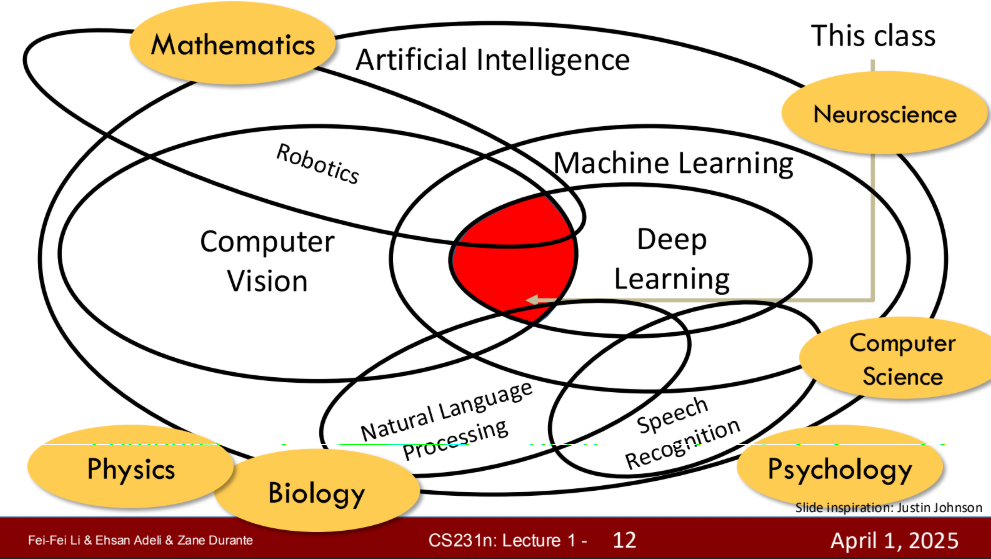

# Stanford CS231N Deep Learning for Computer Vision | Spring 2025 | Lecture 1: Introduction

> Link: [Lecture Video](https://www.youtube.com/watch?v=2fq9wYslV0A&list=PLoROMvodv4rOmsNzYBMe0gJY2XS8AQg16)  
> Slide: [Slide 1](https://cs231n.stanford.edu/slides/2025/lecture_1_part_1.pdf), [Slide 2](https://cs231n.stanford.edu/slides/2025/lecture_1_part_2.pdf)

----

## The Scope of Class 

- Focus on the Core Intersection of Computer Vision and Deep Learning
- The field of AI is becoming increasingly interdisciplinary

## A brief history of CV and DL

### History of Vision 
- Evolution Big Bang; Cambrian Explosion; 540 million years ago
  - Evolution of Vision ~ Evolution of Intelligence 
  - Vision drove the development of nervous system and intelligence
- Camera Obscura
  - Trt to develop device 'which can see'
- CV everywhere
  - Not only camera(apparatus) and also Visual Intelligence

### History of CV & DL
- 1950s 
  - Hubel and Wiesel, 1959
    - Critically Important Experiment in Neuroscience
    - Study about  Mammal's Visual Pathway
    - Neurons feed each other, create big network of computation  
        \: Profound Impact on the NN modeling of visual algorithm
- 1960s 
  - Larry Roberts, 1963
    - How to understand the surfaces, corners and features of object like humans normally do
  - Summer Vision Project(MIT), 1966
    - Start of CV as a academic field
- 1970s
  - David Marr, 1970s
    - Restoration 2D to 3D representation: Key of Solving vision problem
      - Mathematically, ill-posed problem(불량조건문제)
      - Fundamental Problem nature had to solve and CV has to solve
        - *Nature's solution is developing multiple eyes*
      - Language(Generated by Human) vs Vision(Existing in Nature, Physically)
        - How did nature solve these problems?
  - Recognition via Parts
    - Fishcler and Elshlager, 1973: Pictorial Structures
    - Brooks and Binfold, 1979: Generalized Cylinders
- 1980s
  - Recognition vis Edge Detection
    - Digital photos were appeared!
    - John Canny, 1986
    - David Lowe. 1987
- AI Winter Starts
  - Expert systems failed
  - But, some research (subfields) started to grow
- Another grown research field: Cognitive and Neuroscience
  - Point to the Problems we should work on
  - How do we recognize things?
  - How fast do we recognize (and find out) things?  
    -> Remarkable Visual System  
    -> Need to study not only (simple) character shapes and sketches but also **Object(Visual) Recognition**
- 1990s
  - Still in AI Winter, But...
  - Recognition via Grouping
    - Shi and Malik, 1997: Normalized Cuts
- 2000s 
  - Recognition via Matching
    - David Lowe, 1999: SIFT
  - Face Detection
    - Viola and Jones, 2001
    - Taken into the industry (like Auto Focus in Digital Camera)

## Course Overview
